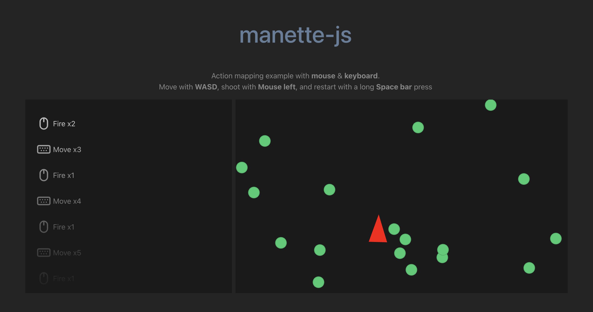

# manette-js

[](https://github.com/DavidPeicho/manette-js/actions/workflows/node.js.yml)

Manette (\\ma.nɛt\\) is an action mapping library for JavaScript.

> 🚧 manette-js is released as a beta until the API is stabilized 🚧



**Features**:

* Supported devices:
    * ⌨️ Keyboard
    * 🖱 Mouse
    * 🎮 XR Gamepad (MetaQuest, etc..)
* Interactions:
    * Down: Triggered **each frame** until released
    * Press: Triggered **once** upon press
    * LongPress: Triggered **once** after a time threshold

Getting started:

* [Example Demo](https://davidpeicho.github.io/manette-js/)
* [Example Source](./example/src/index.ts)

## Install

Using `npm`:

```sh
npm i manette-js
```

Using `yarn`:

```sh
yarn add manette-js
```

## Usage Example

```js
import {
    BooleanAction,
    Axis2dAction,
    ActionManager,
    BooleanMapping,
    EmulatedAxis2dMapping,
    KeyboardDevice,
    MouseDevice,
    XRDevice,
    Handedness,
} from 'manette-js';

// Player performs a fire action.
const fire = new BooleanAction();
// Player performs a move action (forward / backward / left / right).
const move = new Axis2dAction();

// Create devices: One mouse, one keyboard, and two gamepads (one per controller).
const mouse = new MouseDevice('mouse');
const keyboard = new MouseDevice('keyboard');
const rightGamepad = new XRDevice('right', Handedness.Right);
const leftGamepad = new XRDevice('left', Handedness.Left);

const manager = new ActionManager();

// Player can fire either with the mouse, or the right controller.
manager.add(fire, [
    new BooleanMapping(mouse, MouseBinding.Primary),
    new BooleanMapping(rightGamepad, XRButtonBinding.Trigger),
], new PressTrigger());

manager.add(move, [
    // WASD mapping to the value: [-1; 1].
    new EmulatedAxis2dMapping(keyboard, {
        maxY: KeyboardBinding.KeyW,
        minX: KeyboardBinding.KeyA,
        minY: KeyboardBinding.KeyS,
        maxX: KeyboardBinding.KeyD,
    }),
    // Player moves with the left controller joystick.
    new Axis2dMapping(leftGamepad, XRAxisBinding.Joystick)
]);

fire.completed.add(() => console.log('Pew!'));

let previousTime = performance.now();
function animate() {
    const dt = performance.now() - previousTime;
    // XR controllers need to be updated once per frame,
    // at the opposite of the keyboard and mouse ones.
    rightGamepad.update(dt);
    leftGamepad.update(dt);
    window.requestAnimationFrame(animate);
}
animate();
```

## ToDo

* [X] Overridable trigger
* [ ] Serialization & Deserialization of the action manager state
* [ ] Touch support

## Attributions

* Thanks to Dazzle UI for the [SVG icons](https://www.svgrepo.com/svg/533083/keyboard) used in the example.
